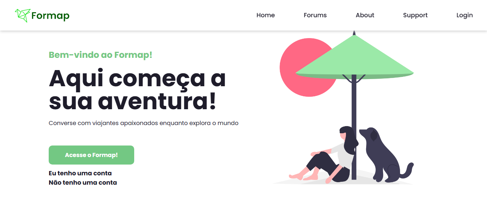
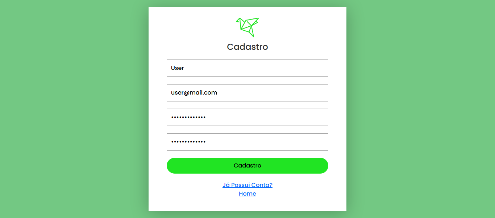
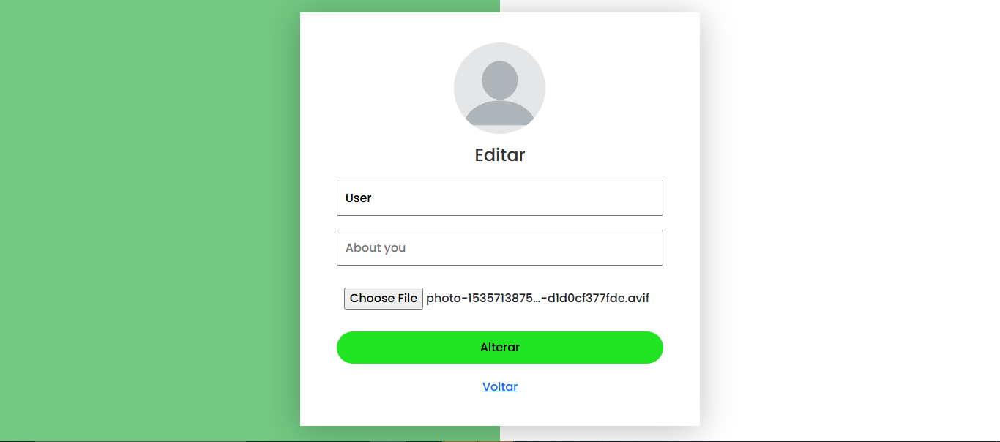
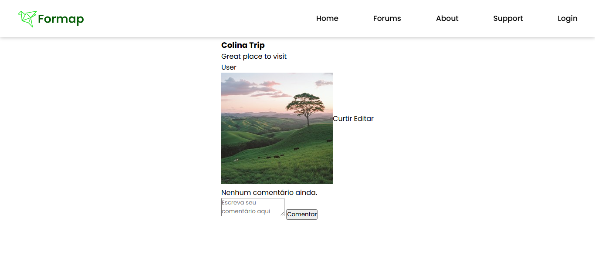
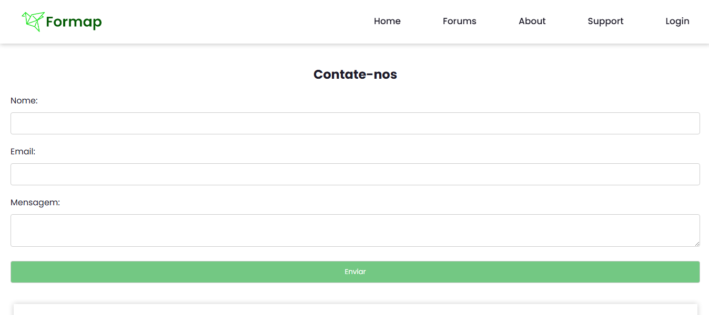

# Canidian (Restored PHP/MySQL Project)

> **Restored academic project developed using PHP and MySQL.**

## 📖 About the Project

**Canidian** is a web-based discussion forum platform developed as an academic project using **PHP** and **MySQL**.

The system allows users to:

- Create an account
- Log in
- Create posts
- Like posts
- Comment on posts
- Edit their own posts
- Browse different discussion forums

---

## ⚠️ Project Status

This repository contains a **restored version** of the original project.

The original source code was recovered after being lost on a web hosting service that is no longer available.

During the restoration process, some features were adjusted just enough to make the application functional again. Therefore, this project **does not represent a final or fully polished version**, and its original structure has been preserved whenever possible.

---

## 🛠 Technologies Used

- PHP
- MySQL
- HTML
- CSS
- JavaScript
- WampServer

---

## 🚀 Getting Started

### Requirements

- WampServer
- PHP
- MySQL

### Installation

1. Clone the repository:

```bash
git clone https://github.com/Marcio-Gazzinelli/canidian-php.git
```

2. Copy the project folder to:

```
C:\wamp64\www\
```

3. Start **Apache** and **MySQL** using WampServer.

4. Open **phpMyAdmin**.

5. Create a database (for example, `usuario`).

6. Import the SQL script:

```
service/Banco_Formap.sql
```

7. Configure the database connection in:

```
service/config.php
```

Example:

```php
$dbHost = "localhost";
$dbUsername = "root";
$dbPassword = "";
$dbName = "usuario";
```

8. Open the project in your browser:

```
http://localhost/canidian/
```

---

## 🗄 Database

The SQL script required to create the database schema and initial records is available at:

```
service/Banco_Formap.sql
```

---

## 📷 Screenshots

### Home



### Sign Up



### User Profile



### Forum Post



### Support



---

## 🎓 Purpose

This project was originally developed as a group academic assignment and was later restored for preservation, reference, and portfolio purposes.
